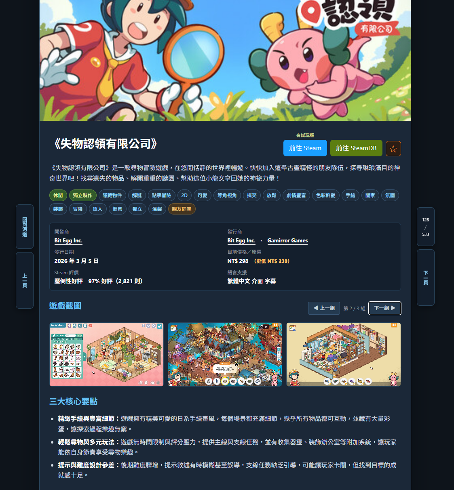
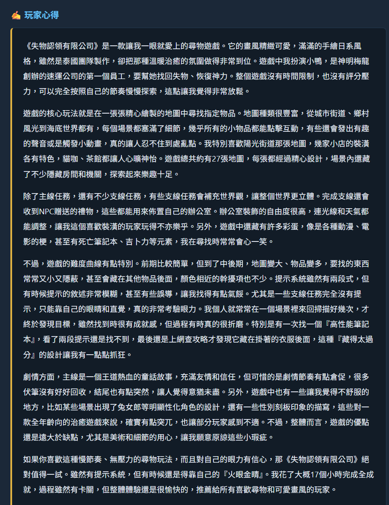
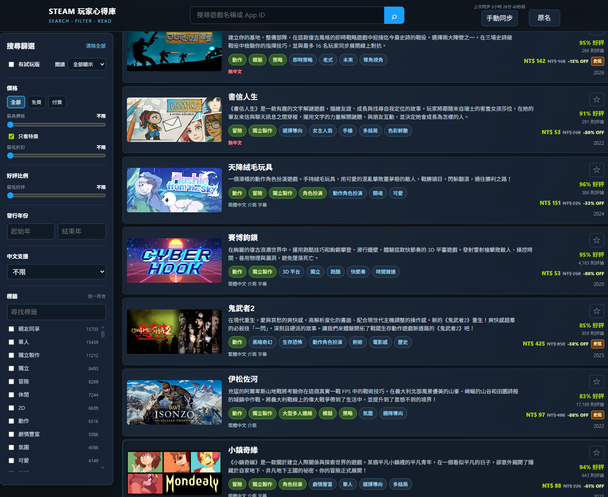

# Steam 玩家心得庫｜GitHub Pages 與單檔網頁使用說明

這是一個可以直接用瀏覽器開啟的 Steam 遊戲搜尋與閱讀網頁。

你可以用它來：

- 搜尋遊戲名稱、繁體中文名或 App ID
- 依價格、特價、折扣、好評、年份、中文支援與標籤篩選
- 收藏遊戲，並記錄已讀進度
- 使用探索河道、收藏、願望清單與已擁有遊戲河道
- 閱讀玩家心得、三大核心要點與遊戲截圖
- GitHub Pages 版可直接讀取中央價格；選配安裝油猴腳本可使用 Steam 即時備援及清單匯入

單檔網頁不需要安裝程式，也不需要啟動本機伺服器（server）。

## 這個資料庫的特色

- **AI 模仿玩家心得寫法**：將 Steam 玩家心得中的玩法感受、優點與注意事項，整理成容易快速閱讀的心得與三大核心要點。這些內容是 AI 生成的整理，不是 Steam 官方立場，也不是玩家原文逐字轉載；重要資訊請回 Steam 原頁確認。
- **涵蓋接近所有極度好評遊戲**：資料庫以 Steam 遊戲資料建立，收錄範圍涵蓋接近所有獲得「極度好評」評價的遊戲；實際內容會受資料更新時間與可取得資料影響。

## GitHub Pages 網頁版

GitHub Pages 的入口是 `index.html`。它會載入 `assets/` 的樣式與程式，再從 `data/games-*.json` 載入分片遊戲資料；`data/price.json` 則是中央特價快照。這些資料都放在子資料夾，方便查找與更新。

GitHub Pages 版不使用 100MB 單檔，也不需要油猴就能搜尋、閱讀、收藏及讀取中央價格。只有中央價格無法使用時，才需要油猴作為 Steam 即時備援；願望清單與已擁有遊戲匯入也仍需要油猴。

---

## 畫面預覽







## 你需要的檔案

如果使用 GitHub Pages，只需要開啟：

```text
index.html
```

如果要直接開啟單檔網頁，只需要：

```text
steam_portal.html
```

如果還想使用 Steam 即時備援或匯入 Steam 清單，另外準備：

```text
steam_portal.user.js
```

### 開啟時的價格同步

單檔網頁每次開啟時會直接從 GitHub 下載中央 `price.json`，不會把每位訪客的瀏覽器當成價格伺服器。中央快照在 12 小時內時，頁面不會向 Steam 發出價格請求。

只有中央檔案無法下載、格式錯誤或超過 12 小時，才會在已安裝油猴腳本的情況下，改由油猴向 Steam 讀取價格。上方的「手動同步」按鈕也會先重新下載中央檔案；只有中央檔案不能使用時，才會改向 Steam 讀取。

`data/price.json` 是 GitHub Actions 使用的中央快照；單檔 HTML 不依賴旁邊的 JSON，所以把 HTML 單獨複製出去仍會使用 GitHub 上的最新快照。

GitHub Actions 預設在台灣時間每日 `02:10、06:10、10:10、14:10、18:10、22:10` 更新一次。排程若遇到 GitHub 負載，實際執行時間可能稍有延遲；也可以在 Actions 頁面手動執行。

單檔版建議把兩個檔案放在同一個資料夾：

```text
Steam玩家心得庫/
├─ steam_portal.html
└─ steam_portal.user.js
```

### 從 GitHub 取得

`steam_portal.html` 約 104 MiB，超過 GitHub 一般 Git 檔案的 100 MiB 限制，因此本 repo 使用 Git LFS 保存單檔下載版。GitHub Pages 不會部署這個 LFS 單檔，而是部署 `index.html`、`assets/` 與 `data/games-*.json` 分割版。

要下載完整單檔版，建議先安裝 [Git LFS](https://git-lfs.com/)，再執行：

```bash
git lfs install
git clone https://github.com/gesen2egee/steam_portal.git
```

如果沒有安裝 Git LFS，下載到的可能只是小型指標檔，無法直接開啟完整網頁。

---

## 一、直接開啟單檔網頁

1. 用瀏覽器開啟 `steam_portal.html`。
2. 可以直接雙擊檔案，不需要安裝網站伺服器。
3. 第一次開啟時，網頁需要解析內含的遊戲資料，請稍等一下。
4. 封面、截圖與 Steam 連結需要網路才能載入。

目前完整資料約有一萬五千款遊戲，HTML 檔案可能接近 100 MB。這是正常的。網頁會分批顯示遊戲卡片，不會一開始把所有卡片都畫出來，但第一次開啟仍然需要讀取整個資料檔。

請固定使用同一個瀏覽器、同一個瀏覽器設定檔，以及同一個檔案位置開啟。這樣收藏、河道與已讀狀態才會持續保留。

---

## 二、GitHub Pages 與油猴腳本

使用 GitHub Pages 搜尋、閱讀、收藏及讀取中央 `price.json`，不需要油猴。

如果你想要以下功能，才需要安裝油猴：

- 中央價格檔案無法使用時，向 Steam 即時讀取特價
- 匯入 Steam 願望清單
- 匯入 Steam 已擁有遊戲

### 安裝步驟

1. 在 Edge 或 Chrome 安裝一個可信任的使用者指令碼管理器，例如 Tampermonkey（竄改猴）或 Violentmonkey。
2. 先在瀏覽器網址列開啟擴充功能設定：

   ```text
   Edge：edge://extensions/
   Chrome：chrome://extensions/
   ```

3. 找到 **Tampermonkey（竄改猴）**，按「詳細資料」。
4. 在詳細資料頁把下面兩個選項都打開：

   - **允許使用者指令碼**
   - **允許存取檔案 URL**

   這兩個都要開，只開其中一個仍可能無法同步。

5. 回到 Tampermonkey 儀表板，用「新增」或「匯入」功能安裝 `steam_portal.user.js`。
6. 確認 `steam_portal.user.js` 已啟用。
7. 重新整理 `steam_portal.html`。

如果你的瀏覽器版本沒有顯示「允許使用者指令碼」，請依 Tampermonkey 顯示的提示開啟「開發人員模式」；**「允許存取檔案 URL」仍然要在竄改猴的詳細資料頁開啟**。

最短路徑就是：

```text
edge://extensions/
→ 找到 Tampermonkey（竄改猴）
→ 詳細資料
→ 允許使用者指令碼：開
→ 開啟允許存取檔案 URL
```

Chrome 則把第一行改成 `chrome://extensions/`。不同版本的瀏覽器或擴充功能名稱可能稍有不同。

官方參考：[Tampermonkey 本機檔案權限說明](https://www.tampermonkey.net/faq.php?q=Q204)、[Microsoft Edge 擴充功能檔案 URL 權限](https://support.microsoft.com/en-US/edge/change-site-access-permissions-for-extensions-in-microsoft-edge)。

### 使用時的登入條件

請在同一個瀏覽器設定檔登入 Steam，再開啟入口網頁。

油猴腳本會使用目前瀏覽器的 Steam 登入狀態讀取資料，不需要另外輸入 Steam 密碼。不要在無痕視窗與一般視窗之間混用。

---

## 三、搜尋與篩選

### 搜尋

上方搜尋框可以搜尋：

- Steam 原始遊戲名稱
- 繁體中文遊戲名稱
- App ID

不論目前顯示原名或繁體中文名，都可以用另一種名稱搜尋。

### 篩選

左側可以依照以下條件篩選：

- 價格、免費或付費
- 最高價格
- 只看特價
- 最低折扣
- 最低好評比例
- 發行年份
- 中文支援
- 有試玩版
- 遊戲標籤

標籤會合併遊戲類型、Steam 熱門標籤與多人遊戲目錄。相同名稱只會保留一次；搜尋標籤時，只要其中一個來源符合就會算符合。

綠色標籤代表它來自 Steam 的遊戲類型。

中文支援共有四種：

- 不限
- 繁體中文
- 中文
- 無中文

只要繁體中文有介面、字幕或語音其中一項，就算繁體中文。只有繁體中文沒有支援、但簡體中文有支援時，才會顯示簡體中文。兩者都沒有才算無中文。

---

## 四、閱讀河道

河道就是可以持續往下看的遊戲清單，而且每個河道會記住自己的位置。

### 河道種類

- 探索河道：每次重新開啟網頁時重新安排順序，未讀遊戲會優先顯示。
- 收藏河道：你收藏的遊戲。
- Steam 願望清單：從 Steam 匯入的願望清單。
- Steam 已擁有遊戲：從 Steam 匯入的遊戲清單。
- 搜尋河道：在探索河道使用名稱搜尋或標籤，並用左右鍵切換到下一款遊戲後才會建立。

收藏、願望清單與已擁有遊戲是固定河道，不會被手動刪除。自訂的搜尋河道可以刪除。

### 開啟與收起河道

河道預設會收起。

- 按「展開」可以看到河道列表。
- 按「收起」後，仍會保留目前所在的河道。
- 不在探索河道時，上方會提供回到探索河道的按鈕。
- 點擊河道名稱是回到該河道，不是直接開啟遊戲。
- 重新開啟入口後，固定河道會從第一項開始；同一次使用期間會記錄你目前看到的位置。

河道列表會無限下滑。往下閱讀時，才會繼續載入下一批遊戲。

### 已讀與未讀

進入遊戲詳情頁，就會記錄為已讀。

河道上方的選單可以選擇：

- 全部顯示
- 只看未讀
- 只看已讀

探索河道的進度是「已讀／全部」。收藏、願望清單與已擁有遊戲中的遊戲會視為已讀。

### 篩選何時會建立新河道

只有在探索河道使用「搜尋」或「標籤」時，才可能建立新的搜尋河道。

第一次點開遊戲不會立刻建立。從該結果用左右方向鍵切換到其他遊戲後，才會建立並保存這條搜尋河道。

價格、特價、折扣、好評、年份、中文支援與試玩版等篩選，不會建立新河道，只會暫時篩選目前的河道。

---

## 五、開啟遊戲與快捷鍵

| 操作 | 功能 |
| --- | --- |
| 點擊遊戲卡片 | 開啟遊戲詳情 |
| 左方向鍵 | 上一款遊戲 |
| 右方向鍵 | 下一款遊戲 |
| `Esc` | 詳情頁回到河道；河道頁開啟目前位置 |
| `F` | 加入或取消收藏 |
| 右側 `Ctrl` | 加入或取消收藏 |
| `1` | 顯示上一組截圖 |
| `2` | 顯示下一組截圖 |
| 點擊原名／繁中名按鈕 | 切換整個網頁的顯示名稱 |

詳情頁的截圖一次顯示三張，可以使用畫面上的按鈕或快捷鍵切換下一組。

---

## 六、同步 Steam 特價

入口會先從 GitHub 下載中央 `price.json`。手動同步也會先重新下載中央檔案；只有檔案不能使用或超過 12 小時時，才會在已安裝油猴的情況下使用 Steam 的 `appdetails`。

### 自動同步時間

以下任一條件成立，開啟入口時就會自動同步：

- 第一次使用，或某些遊戲還沒有特價資料
- 距離上次完整同步已經超過 8 小時
- 美國太平洋時間每天上午 10 點之後，當天第一次開啟入口

這裡的上午 10 點是美國太平洋時間，不是台灣時間。

### 同步方式

- 每批同步 500 款遊戲。
- 會依序同步到全部完成。
- 右上角會顯示同步進度。
- 「手動同步」會先重新下載 `price.json`；中央檔案不能使用時，才會改由油猴同步全部遊戲。
- 請求失敗時會依 1、3、5、7、9 秒等待後重試。

同步時間會依網路與 Steam 回應速度而不同，通常需要數十秒或更久。

目前價格、原價、折扣與上次同步時間會保存在瀏覽器中。已知特價超過 Steam 提供的結束時間後，網頁會在本機自動視為非特價；沒有結束時間的資料不會自行猜測是否過期。

---

## 七、匯入 Steam 願望清單與已擁有遊戲

這項功能需要：

- 已安裝並啟用 `steam_portal.user.js`
- 在同一個瀏覽器設定檔登入 Steam
- Steam 清單頁完整載入

### 匯入願望清單

1. 在入口按「匯入願望清單」。
2. 網頁會自動開啟 Steam 願望清單頁。
3. 等待 Steam 清單載入完成。
4. 油猴腳本會讀取清單並傳回入口。
5. 入口會建立或更新「Steam 願望清單」河道。

### 匯入已擁有遊戲

1. 在入口按「匯入已擁有遊戲」。
2. 網頁會自動開啟 Steam 遊戲清單頁。
3. 等待清單載入完成。
4. 油猴腳本會讀取遊戲並傳回入口。
5. 入口會建立或更新「Steam 已擁有遊戲」河道。

也可以直接開啟已登入的 Steam 願望清單、個人遊戲清單或 Library 頁面，再使用油猴顯示的匯入按鈕。

### 匯入結果的規則

每次「完整且成功」的匯入結果，會取代該清單上一次成功的內容：

- Steam 目前有的遊戲會依清單順序更新。
- 上次有、這次成功清單沒有的遊戲會移除。
- 匯入失敗、登入失效或只讀到一部分時，會保留上一次成功的清單。
- Steam 有、但入口沒有對應資料的遊戲會被忽略。
- 清單為空時，對應河道會隱藏。

請不要在清單還沒載入完成前關閉 Steam 分頁。

---

## 八、收藏與資料保存

網頁會把以下資料保存在目前瀏覽器的 `IndexedDB`：

- 收藏
- 已讀狀態
- 河道順序與目前位置
- 河道收起狀態
- 河道的全部／未讀／已讀選擇
- 原名／繁體中文名顯示選擇
- 特價同步資料

這些資料是保存在自己的電腦裡，不是雲端同步。換電腦、換瀏覽器或使用無痕視窗時，不會自動出現。

### 建議備份

在入口標題附近按「匯出同步資料」，會下載一個 JSON 備份檔。

換電腦或重新安裝瀏覽器後：

1. 先用同一個瀏覽器開啟入口。
2. 按「匯入同步資料」。
3. 選擇之前下載的 JSON 檔。

匯入的是收藏、已讀、河道與顯示偏好，不包含整個遊戲資料庫。請保留最新的 JSON 備份；目前只接受目前版本的同步格式，太舊的備份可能無法匯入。

### IndexedDB 容量

本入口現在使用 `IndexedDB`，不再把狀態寫進 `localStorage`。Edge、Chrome 等 Chromium 瀏覽器的 `localStorage` 通常約只有 **5 MiB（約 5 MB）／每個來源**；`IndexedDB` 則由瀏覽器依硬碟空間與使用情況管理，沒有固定的 5 MB 上限，適合保存一萬五千款遊戲的特價快取與河道資料。實際配額仍會因瀏覽器版本、磁碟空間與 `file://` 本機檔案規則而不同。

單檔 HTML 約 100 MB 是檔案本身，不會算進 IndexedDB。若頁面顯示瀏覽器不允許使用 IndexedDB，請先按「匯出同步資料」備份；JSON 備份仍可手動保存與恢復。

這次改版不會自動讀取舊版本的 `localStorage`。如果要保留舊版收藏、已讀與河道，請先在舊版按「匯出同步資料」，再在新版按「匯入同步資料」。

---

## 九、常見問題

### 開啟後畫面很久才出現，是卡住了嗎？

一萬五千款資料都放在同一個 HTML 內，第一次開啟需要解析整份資料。先等候一段時間，並確認瀏覽器沒有顯示「沒有回應」。

如果仍然無法開啟：

- 關閉其他大量分頁後再試。
- 使用 Edge 或 Chrome 的一般視窗。
- 確認檔案沒有在下載尚未完成時就開啟。
- 重新取得一份完整的 `steam_portal.html`。

### 網頁可以開，但封面沒有出現

封面與截圖是從 Steam 網路載入的，請確認網路正常。即使圖片暫時載入失敗，搜尋、篩選與文字內容仍可使用。

### 特價同步一直是 0

請依序確認：

1. 油猴腳本已安裝且已啟用。
2. 使用者指令碼管理器允許存取檔案 URL。
3. Edge 已開啟「允許使用者指令碼」。
4. 重新整理入口頁。
5. 先按一次「手動同步」測試。

若 Steam 暫時沒有回應，請稍後再試。同步失敗的批次不會被當成成功資料。

### 匯入只有少數遊戲

入口只會加入已經有本站資料的 App ID。Steam 有、但這個入口尚未收錄的遊戲會被忽略。

另外，請確認：

- Steam 已登入。
- 清單頁已完整載入。
- 油猴腳本在 Steam 頁面上也有啟用。
- 不要太早關閉 Steam 分頁。

如果這次匯入不完整，入口會保留上一次完整成功的結果。

### 關掉再開後收藏不見了

請確認：

- 不是使用無痕視窗。
- 沒有換瀏覽器。
- 沒有換瀏覽器使用者設定檔。
- 還是開啟同一個 HTML 檔案位置。
- 瀏覽器沒有阻擋本機網站資料。

如果原本有備份，使用「匯入同步資料」即可恢復。

### 更新了新的 HTML 後，資料會不見嗎？

請先匯出 JSON 備份，再用新版 HTML 取代舊檔，並放在相同的檔案位置。若瀏覽器仍找不到原本的資料，可以使用 JSON 備份匯入。

### 一定要安裝油猴嗎？

不用。

不安裝油猴仍可使用：

- 搜尋
- 篩選
- 排序
- 閱讀心得
- 收藏
- 閱讀河道
- JSON 匯出與匯入

只有 Steam 即時特價備援與 Steam 清單匯入需要油猴；中央 `price.json` 的正常讀取不需要油猴。

---

## 安全與隱私

單檔網頁本身不需要把收藏、閱讀狀態或河道上傳到任何伺服器，這些資料保存在你的瀏覽器裡。

油猴腳本會代表你向 Steam 讀取價格與清單資料，因此請只安裝自己信任的 `steam_portal.user.js`。它需要使用目前瀏覽器的 Steam 登入狀態，但不應要求你把 Steam 密碼輸入到入口網頁。

封面、截圖與「前往 Steam」連結會連到 Steam 網站，使用時需要網路。

---

## 更新單檔網頁

取得新版 `steam_portal.html` 後：

1. 先在舊版入口按「匯出同步資料」。
2. 關閉舊版入口。
3. 用新版檔案取代舊檔。
4. 確認新版檔案仍放在原本的位置。
5. 重新開啟新版入口。
6. 如果資料沒有自動出現，再按「匯入同步資料」恢復。

如果同時取得新版 `steam_portal.user.js`，請在使用者指令碼管理器中更新或重新安裝它。
